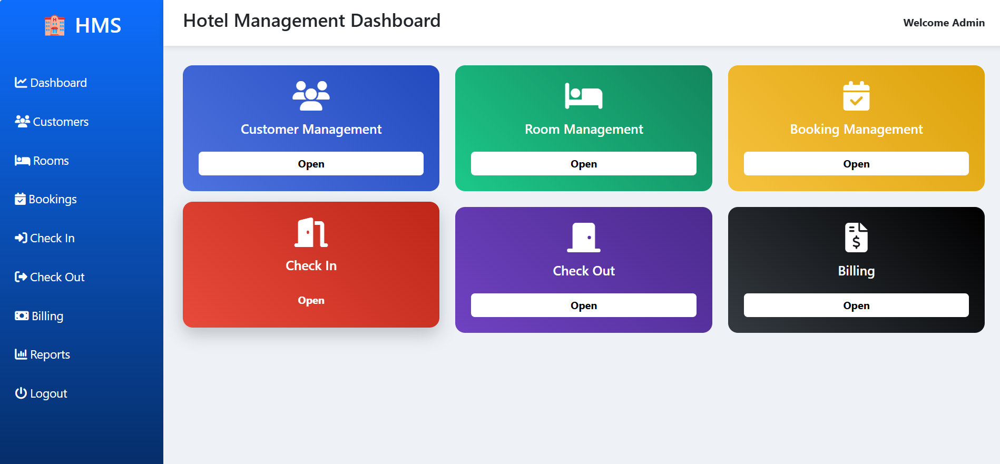
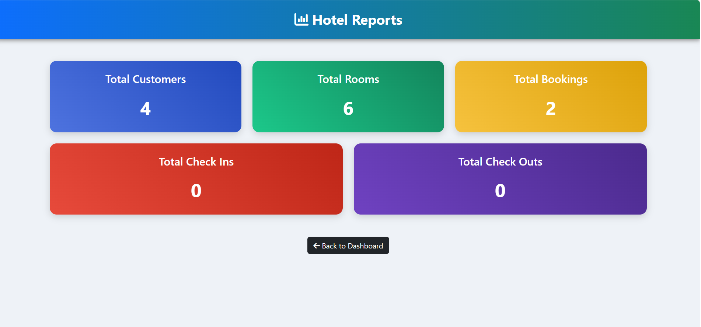

<div align="center">

# 🏨 Hotel Management System

### A Modern Full-Stack Hotel Management Web Application

Built using **Java • JSP • Servlets • JDBC • MySQL • Bootstrap • Apache Tomcat**


---

A complete **Hotel Management System** developed as a Full Stack Java Web Application to simplify hotel operations including customer management, room allocation, bookings, check-in/check-out, billing, and report generation through an intuitive administrative dashboard.

</div>

---

# 📖 Table of Contents

- Overview
- Features
- System Modules
- Technology Stack
- Project Architecture
- Database Design
- Installation Guide
- Project Structure
- Screenshots
- Future Enhancements
- Learning Outcomes
- Author

---

# 📌 Overview

Managing hotel operations manually is time-consuming and error-prone. This project automates the complete workflow of hotel administration by providing a centralized platform for managing customers, rooms, reservations, billing, and reports.

The system follows the **MVC (Model–View–Controller)** architecture and implements CRUD operations using **Java Servlets, JSP, JDBC, and MySQL**.

---

# ✨ Features

## 🔐 Authentication

- Secure Admin Login
- Session Management
- Logout Functionality

---

## 👥 Customer Management

- Add Customer
- Update Customer
- Delete Customer
- View Customer List
- Search Customer

---

## 🛏 Room Management

- Add Room
- Update Room
- Delete Room
- View Available Rooms
- Room Status Management

---

## 📅 Booking Management

- Create Booking
- Update Booking
- Cancel Booking
- View Bookings

---

## 🚪 Check-In Module

- Check-In Customer
- Automatic Room Status Update
- Maintain Check-In Records

---

## 🚪 Check-Out Module

- Check-Out Customer
- Free Room Automatically
- Maintain Check-Out Records

---

## 💳 Billing Module

- Generate Bills
- View Billing History
- Delete Bills

---

## 📊 Reports Module

Provides real-time statistics including:

- Total Customers
- Total Rooms
- Total Bookings
- Total Check-Ins
- Total Check-Outs

---

# 🛠 Technology Stack

| Category | Technologies |
|-----------|--------------|
| Language | Java |
| Frontend | JSP, HTML5, CSS3, Bootstrap 5 |
| Backend | Java Servlets |
| Database | MySQL |
| Connectivity | JDBC |
| Server | Apache Tomcat 9 |
| IDE | Eclipse IDE |
| Version Control | Git & GitHub |

---

# 🏗 System Architecture

```
                 User

                  │

                  ▼

             JSP Pages

                  │

                  ▼

             Java Servlets

                  │

                  ▼

               DAO Layer

                  │

                  ▼

               JDBC API

                  │

                  ▼

              MySQL Database
```

---

# 📂 Project Structure

```
HotelManagementSystemJSP

│

├── src

│   └── main

│       ├── java

│       │

│       ├── dao

│       ├── database

│       ├── model

│       └── servlet

│

│       └── webapp

│           ├── META-INF

│           ├── WEB-INF

│           ├── JSP Pages

│           └── Assets

│

└── README.md
```

---

# 🗄 Database Design

### Database

```
hotel_management
```

### Tables

```
customer

room

booking

checkin

checkout

bill
```

---

# ⚙ Installation

## 1️⃣ Clone Repository

```bash
git clone https://github.com/JanhaviJari/Hotel-Management-System.git
```

---

## 2️⃣ Import into Eclipse

```
File

↓

Import

↓

Existing Projects into Workspace
```

---

## 3️⃣ Configure Apache Tomcat

- Install Apache Tomcat 9
- Add Server in Eclipse
- Deploy Project

---

## 4️⃣ Create Database

Create database:

```sql
CREATE DATABASE hotel_management;
```

Import the SQL file into MySQL.

---

## 5️⃣ Configure Database

Open

```
database/DBConnection.java
```

Update

```java
String url="jdbc:mysql://localhost:3306/hotel_management";

String username="root";

String password="YOUR_MYSQL_PASSWORD";
```

---

## 6️⃣ Run Project

Start Apache Tomcat.

Open

```
http://localhost:8080/HotelManagementSystemJSP
```

---

## 📷 Application Screenshots

### 🔐 Login Page


### 🚪 DashBoard


### 👥 Customer Management


### 🛏 Room Management


### 📅 Booking Management


### 🚪 Check In


### 🚪 Check Out


### 🚪 Reports


---


# 🚀 Future Enhancements

- Online Room Reservation
- Payment Gateway
- Email Notifications
- QR Code Check-In
- Customer Feedback
- Multi-Admin Access
- Cloud Database
- REST API Integration
- Mobile Application
- Data Analytics Dashboard

---

# 🎯 Learning Outcomes

This project strengthened practical knowledge in:

- Java Programming
- JSP
- Java Servlets
- JDBC
- MySQL
- CRUD Operations
- MVC Architecture
- Session Management
- Bootstrap UI
- Git & GitHub
- Database Connectivity

---

# 👨‍💻 Author

## Janhavi Jari

**Computer Science Engineering Student**

GitHub

https://github.com/JanhaviJari

LinkedIn

https://www.linkedin.com/in/janhavi-jari-219a2a290?utm_source=share_via&utm_content=profile&utm_medium=member_android

---

# 🤝 Contributing

Contributions are welcome.

1. Fork the repository

2. Create a feature branch

3. Commit your changes

4. Push the branch

5. Open a Pull Request

---

# 📄 License

This project is developed for **educational and academic purposes**.

---

<div align="center">

### ⭐ If you found this project useful, please consider giving it a Star.

Made with ❤️ using Java Full Stack Development

</div>
